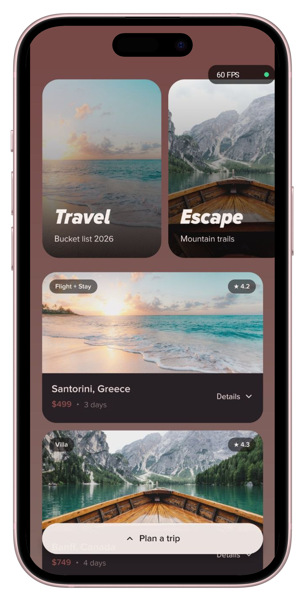
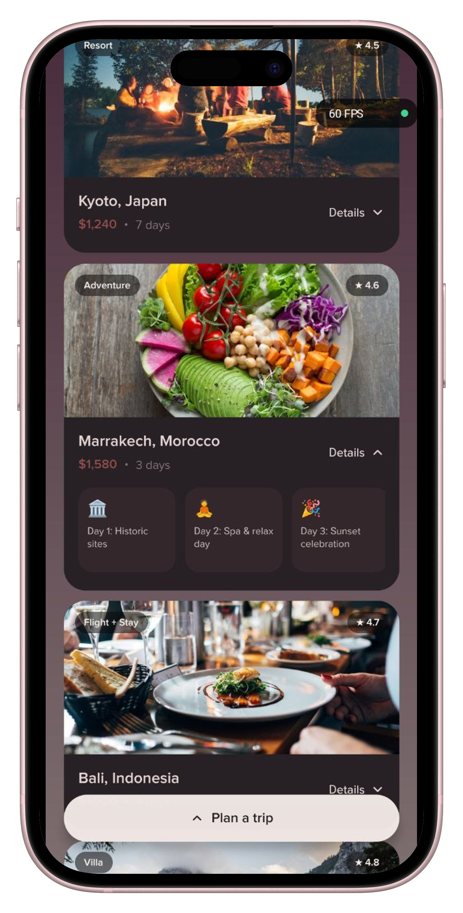
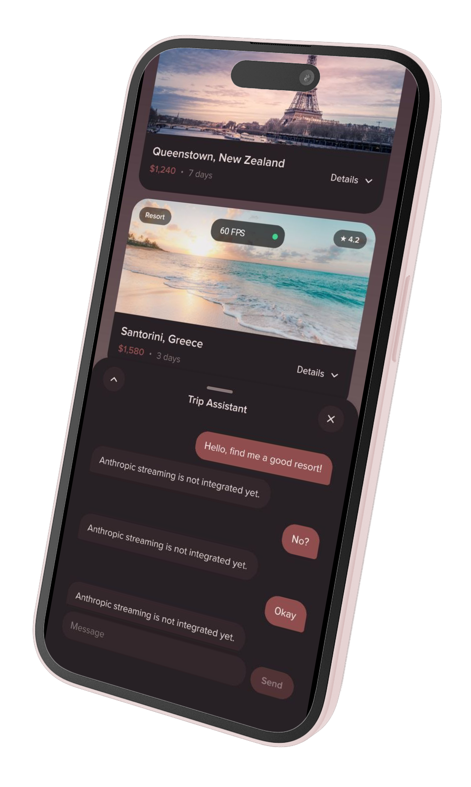
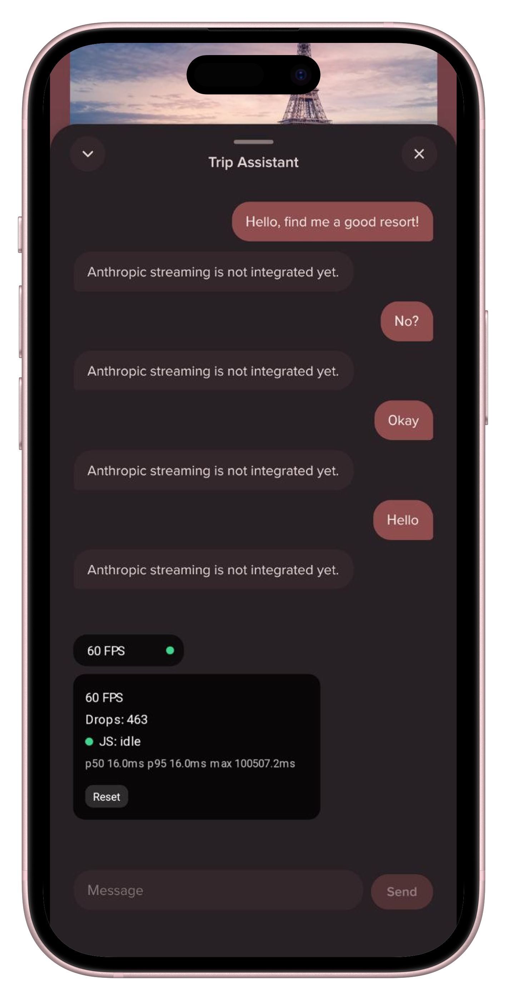
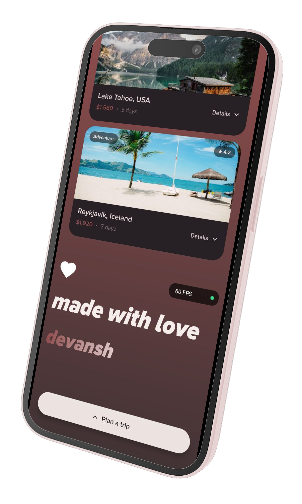

# Crew Travel Discovery Feed

<p align="center">
  
</p>

<p align="center">
  <sub>Watch the full-quality demo video <a href="https://drive.google.com/file/d/1gIZiUyQlCvwo4ydyb01hNo6WqhN_Cp4I/view?usp=sharing">here</a>.</sub>
</p>

<p align="center">
  
  
  
  
  
</p>

A native mobile prototype (Expo SDK 57 / React Native 0.86 / React 19) for a swipeable, Instagram-Explore-style travel discovery feed with an AI trip-planning assistant. Built to explore Reanimated-driven UI-thread interaction patterns — drag-to-expand sheets, worklet-only card animations, and a from-scratch performance instrumentation overlay — rather than to ship a production travel product.

## Tech stack

- **Expo SDK 57** with **expo-router** (file-based routing, typed routes, React Compiler enabled)
- **React 19.2** / **React Native 0.86**
- **react-native-reanimated 4.5** + **react-native-worklets** — all interactive animation runs on the UI thread
- **react-native-gesture-handler** — pan/tap gestures for drag sheets and card toggles
- **@shopify/flash-list 2** — the destination feed and the horizontal hero carousel
- **@shopify/react-native-skia** — animated gradient background, canvas-rendered performance HUD, gradient signature text
- **expo-image** — remote photo loading with blurhash placeholders
- **react-native-keyboard-controller** — keyboard-height-aware layout synced onto the same Reanimated pipeline as the sheet drag
- **expo-haptics** — tactile feedback on taps, drags, and send

## Features implemented

### Discovery feed (`src/app/index.tsx`)
- Full-bleed **animated gradient background**, rendered on a Skia `<Canvas>` and cross-fading through a 4-stop color cycle (`withRepeat`/`interpolateColor`) — purely UI-thread, no re-renders.
- A `FlashList`-backed vertical feed of destination cards, procedurally generated (`buildDestinationFeed`) by cycling a pool of destinations/trip-types/prices/highlights into a long scrollable list.
- A horizontal hero carousel (`HeroCoverCard`) as the feed's `ListHeaderComponent`.
- `FeedFooter` closes the list with a heartbeat-pulsing heart icon (double-beat easing sequence) and a Skia gradient-filled signature ("made with love / devansh"), rendered via Skia's own font loader since plain RN `<Text>` has no gradient-fill API.

### Destination cards (`src/components/cards/DestinationCard.tsx`)
- Tap-to-expand "Details" section revealing a horizontally scrollable set of day-by-day itinerary highlight chips.
- Expand/collapse is a `Gesture.Tap()` worklet that flips a shared value and drives the animation entirely on the UI thread — the JS thread is never in the critical path, so it can't be stalled by `FlashList` cell recycling mid-scroll. Only the haptic call hops to JS (`scheduleOnRN`), since it's a native/JS-thread API.

### Trip Assistant bottom sheet (`src/components/PlanTripSheet.tsx`)
- A continuous **reveal-amount drag model** (closed → half → full) instead of a fixed set of snap animations: below half-height the sheet's height is pinned and `translateY` slides it off-screen; at/above half-height, height itself grows. This keeps the sheet's rendered height always equal to what's actually visible, so bottom-pinned content (the chat input) never ends up below the fold the way it would with a fixed full-height + `translateY`-only approach.
- Drag-to-dismiss: flick-velocity detection (`FLICK_VELOCITY_THRESHOLD`) plus nearest-midpoint snapping when released slowly.
- Keyboard-aware padding is driven by `react-native-keyboard-controller`'s `useReanimatedKeyboardAnimation`, wired into the *same* UI-thread animated style as the sheet's own drag — avoiding the fight between Reanimated's UI-thread updates and `KeyboardAvoidingView`'s JS-thread layout adjustments that was causing keyboard-open glitches.

### Trip Assistant chat (`src/components/chat/`)
- `PlanTripChat` — message list + input row, auto-scrolling to the latest message.
- `TypewriterPrompt` — an animated, looping typewriter effect that types/deletes through a rotating set of example prompts when the conversation is empty.
- `ChatMessageBubble` / `TypingIndicator` — user/assistant bubble styling with a staggered 3-dot pulsing "typing" indicator for pending assistant replies.
- **Not yet wired to a real model.** Sending a message currently just echoes a canned placeholder ("Anthropic streaming is not integrated yet.") after a fixed delay — the UI/UX for streaming responses is built, but no LLM backend is connected yet.

### Performance overlay (`src/components/PerformanceOverlay.tsx`)
A from-scratch, draggable dev HUD (visible in every screenshot/build right now — not gated behind `__DEV__`):
- Live FPS via a windowed count in `useFrameCallback`, rather than a spiky instantaneous `1000/delta`.
- Dropped-frame counting against a 45fps budget, plus a running **p50/p95/max frame time** computed from a 250-bucket, 1ms-resolution histogram (recalculated every 30 frames) instead of sorting a growing sample array.
- **JS-thread liveness detection**: the JS thread ticks a shared "heartbeat" value every 50ms; the UI thread (which can't read a JS-thread clock directly) flags `JS: BUSY` once it's seen no new tick for 200ms, using only its own frame-time deltas.
- Drag-to-reposition (`Gesture.Race(pan, tap)` so a real tap always wins over an unstarted pan) with bounds clamped to the safe-area insets on every edge, and an expandable detail panel that auto-picks grow-up vs. grow-down based on remaining screen space.
- Renders its text/dot entirely on a Skia canvas via `matchFont` (with an explicit Android font-family fallback, since Skia's default `"System"` is an iOS-only pseudo-name that silently renders zero-width glyphs on Android).

### Design system
- Custom typeface (Proxima Nova, several weights/styles) loaded once via `expo-font` for RN text and again via Skia's own font loader for canvas-rendered text.
- Custom SVG icon components (`HeartIcon`, `ChevronDownIcon`, `CloseIcon`) instead of an icon font/library dependency.
- Dark, warm-toned palette (documented in [`ai_help.md`](./ai_help.md)) — near-black backgrounds with a brown/mauve undertone, dusty-rose primary accent (`#904D4E`), used consistently across cards, the sheet, and the chat.

## Project structure

```
src/
  app/
    _layout.tsx        # Root stack, font loading, splash screen, gesture/keyboard providers
    index.tsx           # Home screen: gradient bg, feed, hero carousel, bottom bar, sheet, overlay
  components/
    BottomActionBar.tsx # Floating "Plan a trip" / "Close" pill button
    FeedFooter.tsx       # End-of-feed heartbeat + gradient signature
    PerformanceOverlay.tsx
    PlanTripSheet.tsx    # Draggable bottom sheet hosting the chat
    cards/
      DestinationCard.tsx
      HeroCoverCard.tsx
      ListItemCard.tsx
    chat/
      PlanTripChat.tsx
      ChatMessageBubble.tsx
      TypingIndicator.tsx
      TypewriterPrompt.tsx
    icons/
      ChevronDownIcon.tsx
      CloseIcon.tsx
      HeartIcon.tsx
  constants/
    fonts.ts
  data/
    destinationFeed.ts   # Procedural feed-data generator
```

## Getting started

```bash
npm install
npx expo start
```

This project uses native modules (Skia, Reanimated, worklets, `expo-glass-effect`) that **Expo Go does not support** — run it with a development build instead:

```bash
npx expo run:android
# or
npx expo run:ios
```

## Building a release APK

For a quick sideloadable build (debug-signed, fine for testing on a device):

```bash
cd android
./gradlew assembleRelease
```

Output: `android/app/build/outputs/apk/release/app-release.apk`.

For a properly signed build (or to publish to Play Store), use [EAS Build](https://docs.expo.dev/build/setup/) — it manages signing credentials for you:

```bash
npm install --global eas-cli
eas login
eas build:configure
eas build --platform android --profile preview   # add buildType: "apk" in eas.json for a direct-install APK
```

## Known gaps

- The Trip Assistant chat is UI/UX-complete but not connected to a real model — replies are a stub placeholder.
- The performance overlay is a development instrument and currently always renders; it isn't gated behind a dev-only flag.
